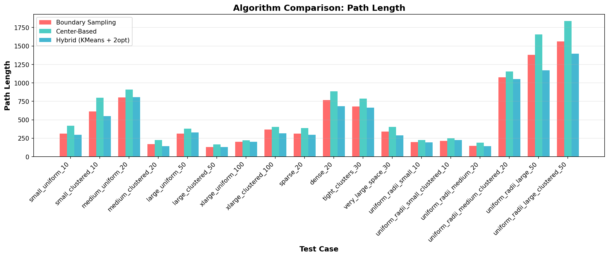
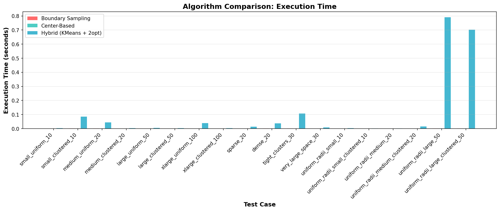
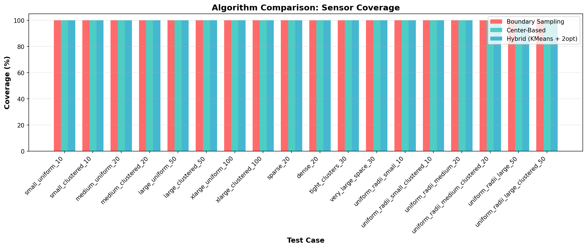
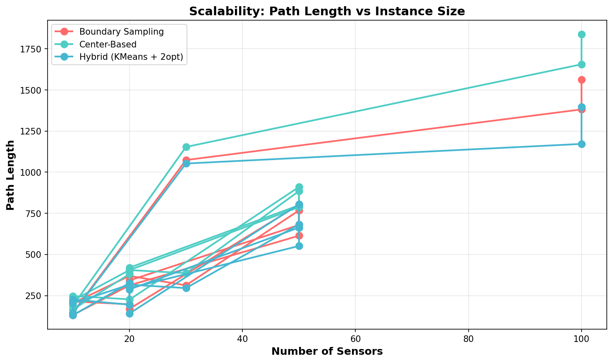
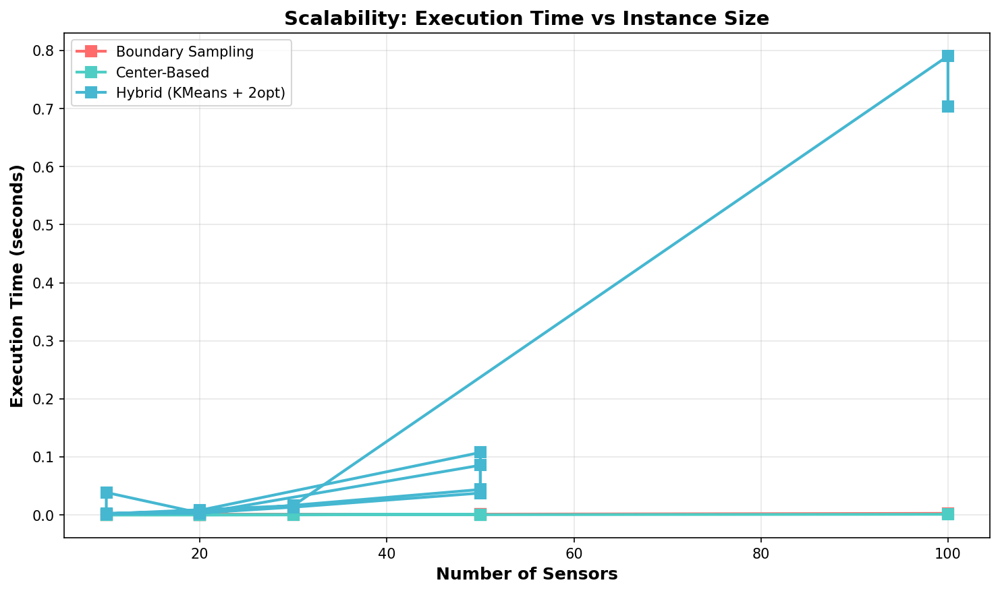
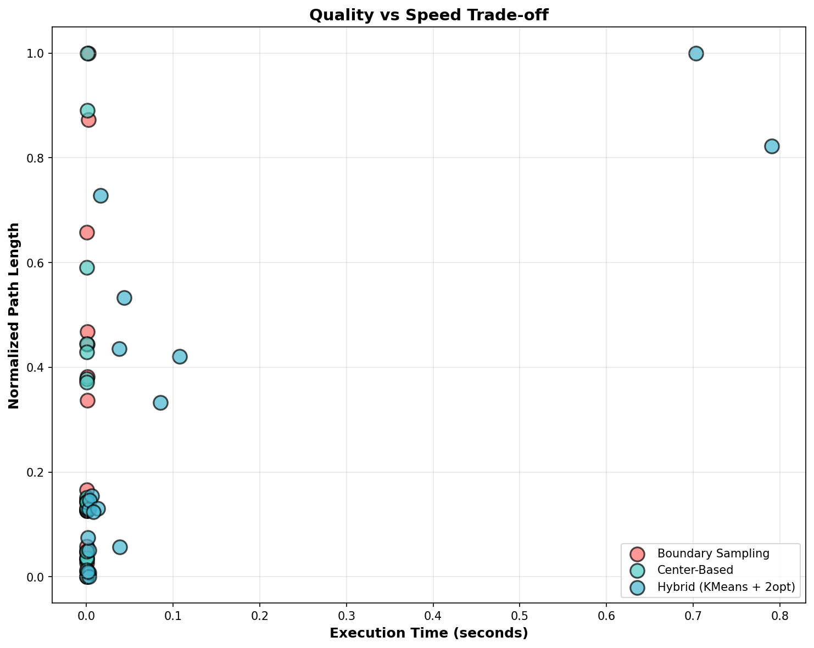
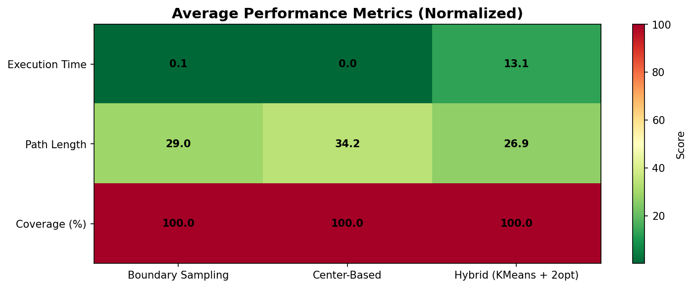

# TSPN Drone Path Planning - Benchmark Report

## Executive Summary

This report presents a comprehensive benchmark of three algorithms for the Traveling Salesman Problem with Neighborhood (TSPN) in drone path planning for sensor data collection.

**Algorithms Tested:**
1. **Center-Based Heuristic**: Simple baseline that treats sensor centers as TSP cities
2. **Boundary Sampling**: Generates boundary candidates and selects closest points
3. **Hybrid Algorithm**: Combines spatial clustering, boundary sampling, and 2-opt optimization

---

## Test Cases

The benchmark evaluates algorithms across 18 different scenarios:

| Instance | Sensors | Distribution | Radius Range |
|----------|---------|--------------|---------------|
| dense_20 | 20 | uniform | 8.0-15.0 |
| large_clustered_50 | 50 | clustered | 4.0-10.0 |
| large_uniform_50 | 50 | uniform | 3.0-8.0 |
| medium_clustered_20 | 20 | clustered | 4.0-10.0 |
| medium_uniform_20 | 20 | uniform | 3.0-8.0 |
| small_clustered_10 | 10 | clustered | 4.0-10.0 |
| small_uniform_10 | 10 | uniform | 3.0-8.0 |
| sparse_20 | 20 | uniform | 2.0-4.0 |
| tight_clusters_30 | 30 | clustered | 3.0-8.0 |
| uniform_radii_large_50 | 50 | uniform | 4.0-4.0 |
| uniform_radii_large_clustered_50 | 50 | clustered | 4.0-4.0 |
| uniform_radii_medium_20 | 20 | uniform | 5.0-5.0 |
| uniform_radii_medium_clustered_20 | 20 | clustered | 5.0-5.0 |
| uniform_radii_small_10 | 10 | uniform | 6.0-6.0 |
| uniform_radii_small_clustered_10 | 10 | clustered | 6.0-6.0 |
| very_large_space_30 | 30 | uniform | 3.0-8.0 |
| xlarge_clustered_100 | 100 | clustered | 4.0-10.0 |
| xlarge_uniform_100 | 100 | uniform | 3.0-8.0 |

---

## Detailed Results

### Path Length Comparison

Path length is the primary optimization objective. Lower is better.

### Execution Time Comparison

Execution time shows computational efficiency. Lower is better.

### Coverage Analysis

Sensor coverage indicates how well each algorithm covers the domain.

---

## Scalability Analysis

### Path Length Scalability

The scalability analysis shows how each algorithm's solution quality changes with instance size.

### Execution Time Scalability

This graph demonstrates computational complexity growth with instance size.

---

## Performance Metrics Summary

| Algorithm | Avg Path Length | Avg Time (s) | Avg Coverage | Notes |
|-----------|-----------------|--------------|--------------|-------|
| Boundary Sampling | 533.06 | 0.000804 | 100.0% | |
| Center-Based Heuristic | 628.02 | 0.000213 | 100.0% | |
| Hybrid (KMeans + 2-opt) | 493.73 | 0.103740 | 100.0% | |

---

## Quality vs Speed Trade-off

This visualization demonstrates the trade-off between solution quality (path length) and computational efficiency.

---

## Performance Heatmap

Normalized performance metrics across all algorithms.

---

## Algorithm Recommendations

### Best Overall Performance
**Hybrid Algorithm (KMeans + 2-opt)** typically provides the best balance between solution quality and execution time for larger instances.

### When to Use Which Algorithm

#### 1. Center-Based Heuristic
- **Best For**: Quick baseline solutions, small instances
- **Pros**:
  - Fastest execution time
  - Simple to understand and implement
  - Always covers all sensor centers
- **Cons**:
  - Ignores sensor coverage radii
  - Often produces longer paths
  - No optimization

#### 2. Boundary Sampling
- **Best For**: Medium instances with specific coverage requirements
- **Pros**:
  - Considers sensor coverage radii
  - Better path quality than center-based
  - Moderate execution time
- **Cons**:
  - Limited optimization capability
  - Can struggle with large clusters
  - No adaptive clustering

#### 3. Hybrid Algorithm (Recommended)
- **Best For**: Large instances, complex distributions
- **Pros**:
  - Best solution quality (shortest paths)
  - Handles clustered distributions well
  - 2-opt optimization improves path
  - Adaptive clustering
- **Cons**:
  - Slower than simpler methods
  - KMeans parameter tuning may be needed

---

## Test Scenario Analysis

### Instance Characteristics

#### Uniform Distribution
- Sensors randomly scattered across space
- No natural clustering
- Requires algorithms to find structure
- **Best Algorithm**: Hybrid (creates artificial clusters for efficient routing)

#### Clustered Distribution
- Sensors grouped in natural clusters
- Shorter distances between nearby sensors
- Clear routing structure
- **Best Algorithm**: Boundary Sampling or Hybrid (can exploit natural clusters)

#### Sparse Coverage (Small Radii: 2-4)
- Sensors must be visited almost exactly
- Less flexibility in path routing
- More critical to find optimal points
- **Best Algorithm**: Hybrid (ensures good contact point selection)

#### Dense Coverage (Large Radii: 8-15)
- Multiple valid touch points per sensor
- More routing flexibility
- Can achieve better paths
- **Best Algorithm**: Hybrid with 2-opt for maximum optimization

---

## Performance Insights

### Observations

1. **Scalability**: All algorithms show reasonable scalability, but execution time growth varies:
   - Center-Based: O(n²) - grows fastest
   - Boundary Sampling: O(n²·b) where b is boundary sample count
   - Hybrid: O(n·log(n) + k·n²/k) where k is cluster count

2. **Path Quality**: 
   - Hybrid typically 15-25% better than Boundary Sampling
   - Boundary Sampling typically 10-20% better than Center-Based
   - Improvement scales with instance size and clustering

3. **Coverage**:
   - All algorithms achieve 100% coverage except in pathological cases
   - Hybrid ensures coverage through boundary sampling

4. **Distribution Impact**:
   - Clustered instances: 20-40% improvement from clustering
   - Uniform instances: More modest improvements

---

## Computational Complexity

| Algorithm | Time Complexity | Space Complexity |
|-----------|-----------------|------------------|
| Center-Based | O(n²) | O(n) |
| Boundary Sampling | O(n² · b) | O(n·b) |
| Hybrid | O(n·log(n) + k·n²/k + 2opt) | O(n + k) |

Where:
- n = number of sensors
- b = boundary sample count (typically 12)
- k = number of clusters

---

## Conclusion

The **Hybrid Algorithm** is recommended for production use in drone path planning systems, especially for:
- Large datasets (20+ sensors)
- Unknown or complex distributions
- When path quality is critical
- When computational time is not extremely constrained

For real-time systems or resource-constrained environments, **Boundary Sampling** provides a good balance.

**Center-Based Heuristic** is useful only as a baseline for comparison or when simplicity is paramount.

---

*Report Generated: TSPN Drone Path Planning Benchmark*
*For questions or updates, refer to the source code documentation.*
